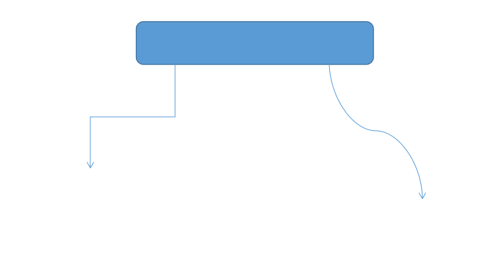

# Does the current vegetation in Heidelberg suffice to compensate the CO2 emissions of the whole city?

<a href="https://github.com/fossgis2122/home/blob/e5aa74674c3a5d00ed566d79ccd8507bb6f41c33/docs/project_deliverables.md">Deliverables</a>

## General information

For a specific point in time we would like to determine the vegetation areas in a region of interest (roi) and compare them with CO2 emission values to find out whether they are sufficient enough to compensate those emissions. The project should serve to correlate CO2 emissions of a roi with its vegetation areas and to be able to make statements about the climate balance. Through automation, different regions should be able to be examined easily. It should be pointed out that all values are estimated and not to be taken as scientific proven.

## Software requirements and Installation

Programs:
- QGIS Desktop 3.22 or newer
- SAGA GIS 7.8.2 or newer
> Both programs are included in the OSGeo4W-Package

### How to install

1. Download the OSGeo4W Installer from <a href="http://download.osgeo.org/osgeo4w/v2/osgeo4w-setup.exe">here</a> (official link to the current network-installer)
2. Run the installer
3. Select Advanced Install, click through the steps and keep the default values
4. Stop at "Choose packages": select the following packages for installation. Click on "Skip" in the column "New" to select a package for installation. If a package is selected for installation, the version number will be shown in the column "New". Under the section Desktop choose:
    - qgis: QGIS Desktop (3.22)
    - saga: SAGA (7.8.2-12)
    - Note: Additional packages will be selected automatically which are needed to run the ones listed above. So just keep those as well.
5. Complete the installation

## Required data

- Multispectral raster data of Heidelberg: Sentinel 2 data (https://scihub.copernicus.eu/dhus/#/home), it's available free and has a resolution of 10m in the needed bands red, green, blue and NIR 
- Vector data of Heidelberg: GADM data by country (https://gadm.org/download_country.html), it's available free, is structured in different administrative levels and comes with interesting additional data
- Emission (CO2) data: OpenGHGMap (https://openghgmap.net/), it's available free, outputs one total emission value per city/region and shows the different sources of emission
- Compensation ability of vegetation: values from literature 

### Aquisition of the required data

> First step: download the file "project_data.zip" and extract the files into a folder (choose a name). This is called the "project folder" in the following steps. The folder "data" in it is referred to as "./data".  
> Take a look at <a href="data_structure.png">data_structure.png</a> for reference:

   
<b>data_structure.png</b>

 
  </img>
  

  

   
<b>How to aquire vector data</b>

 

1. Navigate to <a href="https://gadm.org/download_country.html">GADM data by country</a>, select Germany and download the Geopackage
2. When downloaded, unzip the ZIP-file and move the Geopackage to the folder "./data"

    
    

   
<b>How to aquire raster (Sentinel 2) data</b>

 
    
1. Navigate to <a href="https://scihub.copernicus.eu/dhus/#/self-registration">Copernicus Open Access Hub by ESA registration form</a> and set up an account
2. Log in on <a href="https://scihub.copernicus.eu/dhus/#/home">Copernicus Open Access Hub</a>. Without logging in you cannot download the required data
3. Specify the search area in the map with right-click (move map with left-click and zoom in with mouse wheel)
4. Click on the three stripes left of the search box to open the advanced search (upper left corner of screen)
5. Select Sentinel 2 and put following statement in the box for the cloud cover: [0 TO 10]
6. If you want to search for data in a specific time period, put the required dates in "sensing period" (we recommend using the year 2018 because the emission data is from this year only)
7. Click on the search button (upper right of search box) and wait until the results are displayed
8. Search for an image with full extent (no black parts) and minimal cloud cover
9. Hover over the entry and click on the eye icon ("View product details") which appears along with other icons on the lower right side of the entry
10. Check in the quick look window if the data seems suitable
  
    > If the images you are looking for are offline, you can add them to your cart. Go to your cart (upper left next to the three stripes) and click on download (hover over entry and click on the download icon). It should say that downloading offline products is not possible. At this time, there should appear a clock icon next to the "Offline" text which says either "pending" or "running". Click on the same download button again and it should state that the offline product retrieval is initiated. At this point you did everything the right way. If you encouter problems try again following this manual.  
    > After a while (up to one hour) the datasets will be available to download for three days. Proceed to the next steps to download the data:
11. In the Inspector, navigate to GRANULE/*Name of data*/IMG_DATA/R10m/ and download the two files "...B04..." & "...B08..." (both .jp2)
12. When downloaded, put the two files in the "./data" folder

   
<b>How to aquire emission data</b>

 

1. Navigate to <a href="https://openghgmap.net/">OpenGHGmap</a> and wait until the data is loaded (coloring the base map)
2. Specify the search area by zooming in with the mouse wheel and moving the map with left-click
3. Hover over the region you want to see data from and you'll get a red value which shows the total CO2 emissions in tonnes for the year 2018
4. For convenience you can already put the value in the "Excelsheet.xlsx" which can be found inside the "project_data.zip" in the marked cell beneath "Emission value (t CO2/year)" (blue background). This will be a step at "Part 3: Calculations" (see below)

> Example data is provided through <a href="https://heibox.uni-heidelberg.de/d/b6f83521a8ec4ee5b2f6/">heiBOX</a>. The emission value for Heidelberg is 472.689 t CO2/year (2018).

## How to run

   
<b>Part 1: Preparation</b>

 
    
1. Open the OSGeo4W Shell and navigate to the project folder
2. Execute the script "roi_extractor.bat"
3. You immediately are required to enter the roi. Any name of a city or town should work, for additional information you should look with QGIS into the gadm36_DEU.gpkg and search under column "Name_3" for the exact name of your roi (try e.g. Heidelberg, Karlsruhe, Speyer or Gaggenau) - it has to be in the extent of the Sentinel 2 raster images!
5. Click enter. The outlines of the roi are now automatically saved as a shapefile in the "./data" folder

   
<b>Part 2: QGIS Model</b>

 

1. Open QGIS, navigate to the project folder and double-click on the model "QGIS_Model" to run it
3. Put in all required data:
    - CRS: leave the default setting (we recommend using EPSG:25832 for Germany)
    - the color definition file is "colors.txt" in your "./data" folder
    - the raster bands are the two from the "./data" folder with "B04" and "B08" in their names
    - the vector data input "roi" is the output from the script "roi_extractor.bat", so it should be the shapefile in the "./data" folder named as your input for your roi
    - it's not important where the output files are exported to, you just should find them easily afterwards
4. Uncheck both check boxes
5. Run the model (takes up to 1 min depending on your PC)
6. It outputs one image and one Excel file at the locations you specified as output folders
7. Take a look at the image and compare it to <a href="ndvi_colored.png">ndvi_colored.png</a> - does it makes sense? There should be your roi colored in four colors (no vegetation in red to high level of vegetation in green)
8. Proceed if it looks fine, repeat the steps if something seems wrong. Remember to check your input values in the model!

   
<b>Part 3: Calculations in Excel</b>

 

1. Open the Excel file you got from the model as output 
2. Copy the values from the third column (no title)
3. Navigate to the project folder and open "Excelsheet.xls"
4. Paste the values in the column "HERE (m²)" (blue background)
5. Now put in the emission value from <a href="https://openghgmap.net/">OpenGHGmap</a> in the marked cell under "Emission value (t CO2/year)" (blue background) if you did not already
6. All following values including the result should be automatically calculated
7. The result is displayed through a color in the corresponding cells. It states whether the vegetation suffices to compensate the CO2 emissions of your roi or not

> **Congratulations, you completed this analysis!**

---
## Literature:

NDVI and classification of NDVI-values:
- https://www.researchgate.net/publication/275030305_Evaluating_Multispectral_Images_and_Vegetation_Indices_for_Precision_Farming_Applications_from_UAV_Images
- https://www.earthobservatory.nasa.gov/features/MeasuringVegetation

Sequestation ability values/convert C in CO2 formula:
- https://www.researchgate.net/publication/261699371_Sequestration_and_Carbon_Storage_Potential_of_Tropical_Forest_Reserve_and_Tree_Species_Located_within_Benue_State_of_Nigeria
- https://besjournals.onlinelibrary.wiley.com/doi/epdf/10.1111/j.1365-2664.2011.02021.x
- https://www.unm.edu/~jbrink/365/Documents/Calculating_tree_carbon.pdf
- https://www.frontiersin.org/articles/10.3389/fevo.2016.00053/full
- https://www.co2-acker.de/

Difficulties when balancing CO2 emissions:
- https://www.researchgate.net/publication/352705359_Nur_die_langfristige_CO2-Bindung_zahlt
- https://www.frontiersin.org/articles/10.3389/fevo.2015.00144/full
